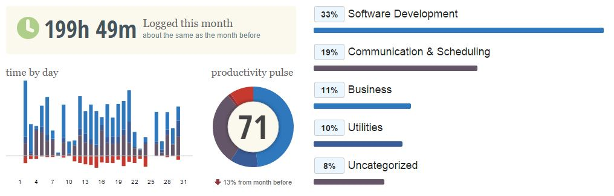
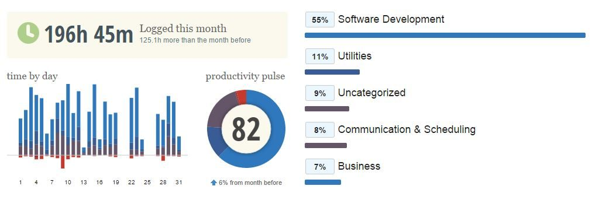

# Get productive

Letztes Jahr war anstrengend. Zum Ende hin, fühlte ich mich extrem ausgelaugt und fertig. Ich hatte nicht mehr das Gefühl, produktiv zu sein. Mit jeder Aufgabe, die ich angefangen habe, habe ich gefühlt zwei neue Aufgaben dazu bekommen. Ohnmacht machte sich breit.

Ich habe mich dann entschlossen, radikal meine losen Enden neu zu knüpfen. Ich habe schon mehrmals, meist nach längeren Abwesenheiten vom Arbeitsplatz, meinen Posteingang radikal geleert. Aber immer hatte ich kurze Zeit danach den selben Effekt, dass ich einfach nicht wußte, welche Aufgabe denn nun die wichtigste ist. Was soll ich machen, wenn ich am Rechner sitze? Was ist überhaupt zu tun? Produktivität hat sich bei mir nur noch selten eingestellt. Am berühmten Tunnel bin ich meist vorbeigefahren, wenn ich überhaupt so weit gekommen bin. Aufgaben konnte ich nur lösen, wenn mich jemand dabei anschrie, bzw. nicht locker lies, bis ich etwas erledigt hatte.

Ich war noch nie ein Organisations-Talent. Ich kann recht gut einschätzen, wie groß der Berg ist, den ich erklimmen muss und wieviel Zeit und Energie ich brauche. Das gelang mir aber zusehens schlechter, weil es mehr und mehr Berge wurde, die ich meistern musste.

Anders als bei [Markus Freise](http://www.markus-freise.de/2015/01/18/facebook-zigaretten-und-die-unendlichkeit-der-stadtbibliothek/) habe ich eigentlich nicht so sehr das Problem, von externen Quellen abgelengt zu werden. Mein Freundeskreis ist einfach nicht so aktiv im sozialen Netz und beruflich habe ich gar keine Berühungspunkte mit Facebook. Das einzige sind ca. 50 RSS Feeds, die ich abonniert habe und daher regelmäßig verfolge. Davon sind aber auch nur wirklich 5 die ich als wichtig betrachten würde, also ungerne verpassen würde, was dort geschrieben wird und dort ab und zu mal meinen Kommentar hinterlasse. Dennoch kann ich Markus wunsch nach "Weniger" sehr gut verstehen.

Ich nehme seinen Post [Woody Allen to the Rescuetime: Ein überragendes Fazit der Facebook-Auszeit in Zahlen](http://www.markus-freise.de/2015/01/31/woody-allen-to-the-rescuetime-ein-ueberragendes-fazit-der-facebook-auszeit-in-zahlen/) daher zum Ansporn, nochmal was zu bloggen. Und zwar, was mich den letzten Monat glücklich gemacht hat.

# Glücklich bleiben

Viele Ideen rund um Produktivität haben sich im Internet verbreitet. Ist doch unter anderem auch das Internet schuld an der heutigen Misere, dass man überhaupt ein "Produktivitätsmanagement" benötigt. GettingThingsDone, Inbox Zero, 43Folders... Will heißen: Es gibt keine perfekte Idee, wie jeder Mensch seinen BurnOut vermeidet. Und ich habe schon so viel über jede dieser Methoden gelesen. Das Internet ist ja voll davon. Bisher ist jeder Versuch gescheitert.

Für mich war es Elementar, den Druck aus meinem Kopf zu bekommen. Ich habe mir, wie so oft zuvor, alles zum Thema GettingThingsDone im Internet gesucht und begann zu lesen. Und langsam breitete sich ein Gedanke in meinem Kopf aus. **Lose Enden**, **lose Enden**, **lose Enden**. Ich begann alles auf Papier zu bringen. Fühlte sich das gut an! Analog! alles raus! raus aus meinem Kopf! Ich schrieb alles auf. Offene Probleme mit Kunden, den nächsten Einkauf für die Familie, die Projekte auf der Arbeit, sowie die Projekte, die zu Hause auf mich warteten. 4 DIN-A4 Seiten sind dabei herausgekommen.

Dieser analoge Vorgang, er wurde zu einem so befreiendem Akt. Und zu einer Erkenntniss: Digital ist falsch! Digital ist nicht ich. Ich liebe es zu programmieren, zu gestalten und zu denken. Aber das mache ich alles Analog. Ich mache das mit mehr als Nullen und Einsen. Es ist nicht schwarz oder weiß, nicht grau sondern bunt in vielen milliarden Farben. Und ich habe noch etwas erkannt: Verschlichtere Dich! Ohh was kann ich ein Lied davon singen, nach wenigen Stunden denken, organisieren, problematisieren wird alles so Komplex. Unüberschaubar Komplex, unbearbeitbar Komplex. Ich habe mir nie Gedanken über den nächsten Schritt gemacht. Das große ganze, das hatte ich im Kopf. Die Spitze des Berges, die hätte ich jedem sofort beschreiben können. Aber die Steine vor meinen Füßen? Die konnte ich erst beschreiben, wenn ich entweder drüber gestolpert bin, sie mir wie eine Gerölllawine über dem Kopf zusammenstürzten oder ich mit dem Gesicht dagegen gelaufen bin (so richtig schön mit Schmackes!). Und das passierte in letzter Zeit zunehmend öfter.

# Analog ist das neue digital

Als nächstes habe ich alles andere, digitale weggeschmissen. Alle alten Emails beiseite gelegt und von vorne angefangen. Dabei hat mir ein Beitrag im Internet den richtigen Anstoß gegeben, den ich leider nicht mehr finde. Anstatt wie zuvor, nach und nach mehr und mehr Ordner anzulegen, um darin sortiert die passenden Mails abzulegen, habe ich mich für 5 Ordner entschieden:

* @Antworten
* @WartenAuf
* Referenzen
* Aufgaben
* Projekte

Von all den Ideen da draußen, hat mich ein Punkt an dieser Struktur am meisten fasziniert. Vereinfachung! Ich will nie wieder so viele Ordner haben. Da programmiere ich lieber 3 Wochen lang eine clevere Suchfunktion (die es schon gibt :)) als jemals wieder viele Ordner zu haben. Bis heute (einen Monat später) habe ich 2 Ordner dazu genommen, da ich erkannt habe, dass ich mehr Interessen habe, deren Relevanz aber nicht so hoch sind.

* @Lesen
* @Irgendwann/Vielleicht

Die analogen Ideen und Aufgaben habe ich mir dann einzeln vorgenommen und entschieden, was das nächste Sein sollte, was ich zur erreichung dieses Ziels, zur erledigung des Problems machen müsste. Wie sieht der Stein aus, den ich als nächstes Überschreiten muss? Wenn es mehr als ein Schritt war, habe ich ein Projekt angelegt und zu jedem Projekt so viele Aufgaben erfasst, wie mir eingefallen sind. Zusätzlich habe ich mir überlegt, wann ich diese Aufgaben lösen könnte. Nicht im zeitlichen, sondern im physikalischen Kontext. Was brauche ich für die Erledigung, wann habe ich das?

# Mehr Zeit für arbeit

Dabei herausgekommen sind 5 Kontexte, an denen Ich mich physikalisch befinde und mit denen ich meine Aufgaben gelöst bekomme.

* @AmRechner
* @Agendas
* @Anrufe
* @Office
* @Besorgungen
* @Irgendwann/Vielleicht
* @ZuHause

60 Aufgaben und 30 Projekte sind dabei herausgekommen.

Und dann fing der Alltag an. Mir waren zwei Dinge sonnenklar: Nie wieder Komplex und zuerst Analog. Ich nahm mir vor, alle Ideen, Punkte, Gedanken auf Papier zu bringen. Mit einem Stifft in ein Buch!

Einen Monat später hat sich mein Alltag verändert. Ich beschäftige mich vornehmlich nicht mehr mit meinen Projekten und Problemen, sondern mit den Tätigkeiten, an denen ich solche Probleme gelöst bekomme. Wenn ich Telefoniere, weiß ich, dass ich mit dieser Tätigkeit mehr als ein Problem gelöst bekomme. Also los, weiter telefonieren. Wenn ich am Rechner sitze und dort ein Problem löse, weiß ich, dass andere Aufgaben genau jetzt gelöst werden können. Also los, weiter am Rechner arbeiten.

Ich habe das Gefühl, dass ich die Kontexte noch ein wenig spezifiziere, etwas besser unterscheide. Ich bin halt 200h im Monat am Rechner. Bei ca. 160 Arbeitsstunden im Monat ist das eine Menge. Ich habe den Vorteil, dass ich meinen Rechner eigentlich nur zum Arbeiten anmache, ob zu Hause oder im Büro. Und da schlage ich die Brücke zum Markus. Seit einer langen Zeit nutze ich Rescuetime um meine Zeiten zu tracken.

Mein Produktivitätsscore liegt ungefähr bei 77%. Früher habe ich regelmäßig Scores > 85% erreicht. Im Januar ergab sich folgendes Bild:

Das ist jetzt gar nicht so besonders, oder besonders anders. Mein Dezember sah so aus:

82% könnte man ja meinen, dass es ja eigentlich ganz gut lief im Dezember. Wenn man aber bedenkt, dass ich mit diesen 82% so mieß und fertig gefühlt habe und gefühlt weit weniger Geschafft habe, als ich hätte schaffen müssen, bin ich mit meinen 71% so viel Glücklicher als letzten Monat :)

Und jetzt habe ich wieder Spaß! Ich befinde mich im Feintuning meiner neuen Arbeits- oder vielleicht sogar Lebensweise. Meine Aufgaben müssen besser beschreiben, was zu tun ist. Die Kontexte, an denen ich meine Aufgaben erledige, möchte ich noch etwas besser auseinander halten.

Im Januar habe ich ca. 400 Emails erhalten (ohne Spam) und es ist mir gelungen, jede Mail zu "scannen" und aus dem Posteingang in den @Antworten Ordner zu verschieben (klappt auch auf dem Handy super!). Daraus resultierten dann kontinuierlich 10-20 Mails die auf beantwortung warteten. Am Freitag ist es mir dann das erste mal gelungen, den @Antworten-Ordner leer zu machen. Ich konnte also alle Fragen beantworten, die in 400 Emails auf mich zu gekommen sind. Der @WartenAuf-Ordner beinhaltet ca. 15 Mails pro Tag und am Ende von Monat eins habe ich 87 Aufgaben, die ich erledigen kann. 40 Projekte habe ich mittlerweile erstellt und 2 Projekte vollständig abgeschlossen (nicht jedes "Projekt" ist hier erfasst, nur die, für die ich mehr als einen Schritt brauche!).
