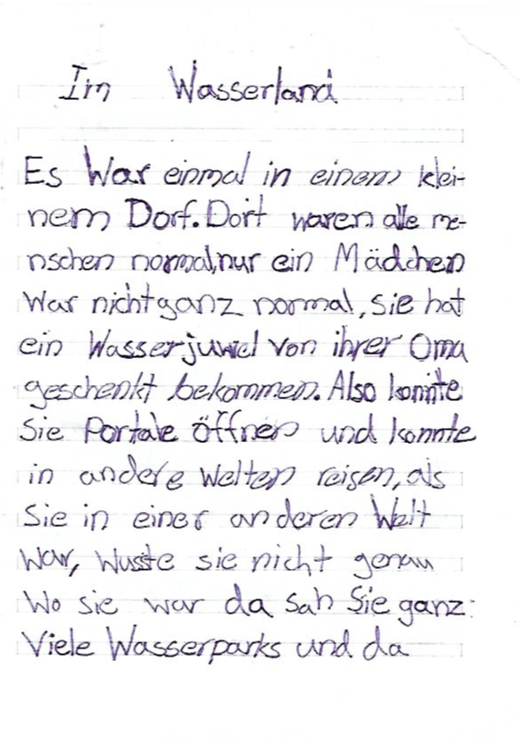
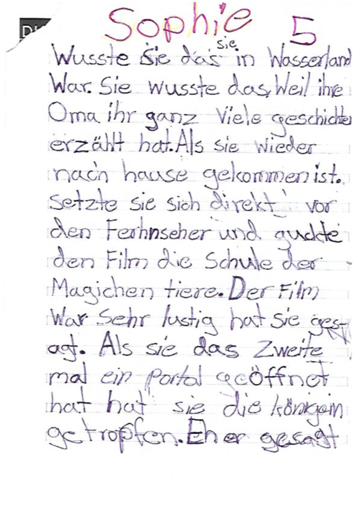
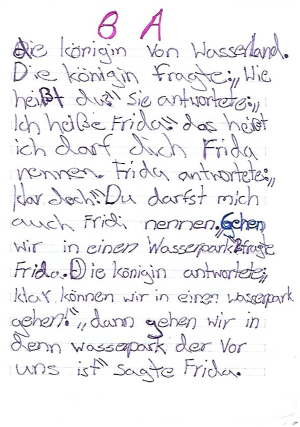
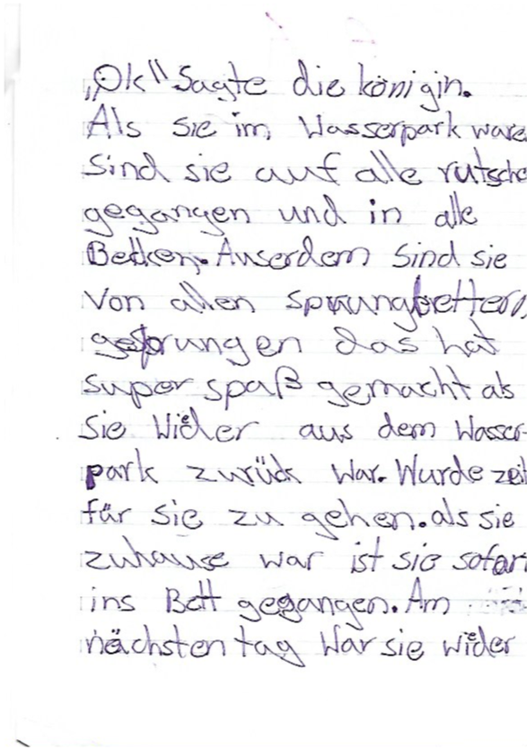
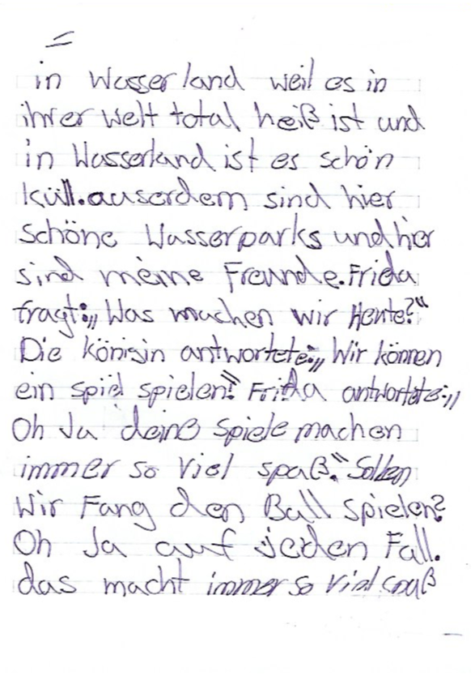
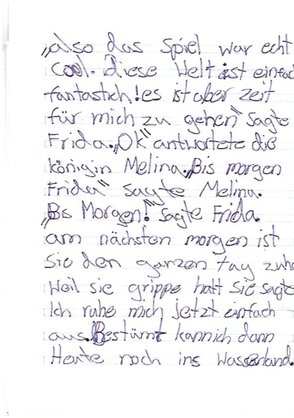
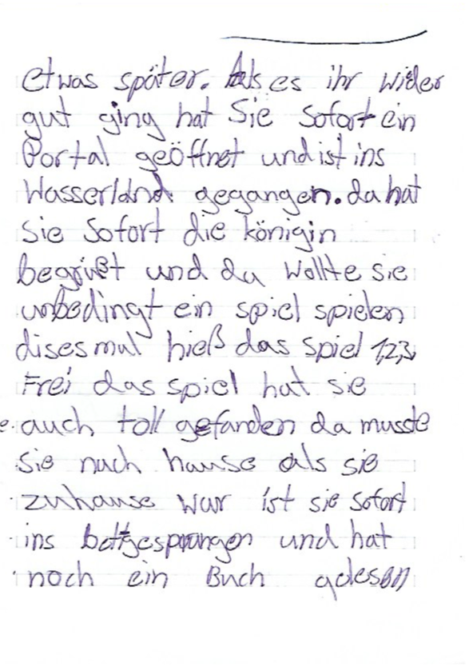
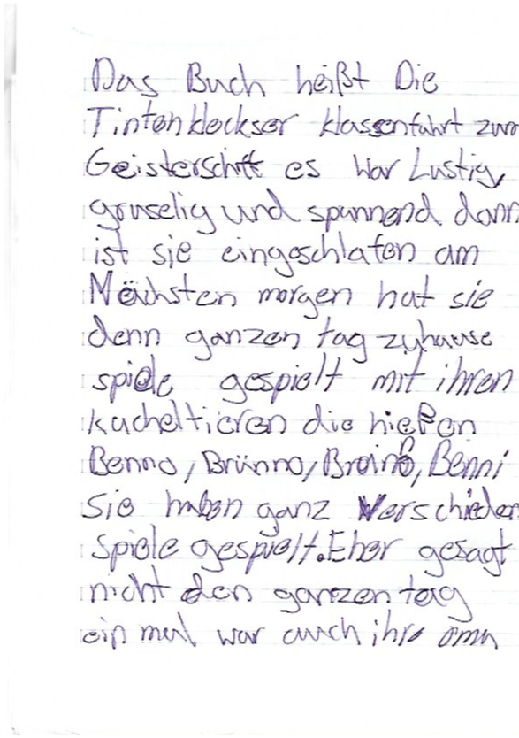
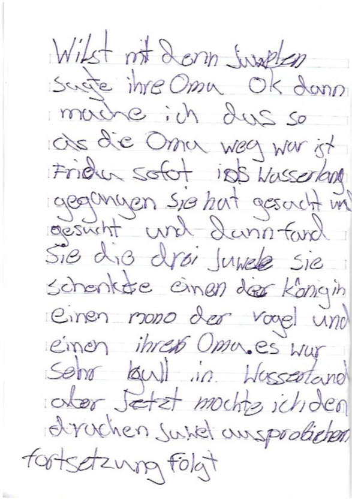

# Im Wasserland

Es war einmal in einem kleinem Dorf. Dort waren alle Menschen normale, nur ein Mädchen war nicht ganz normal, sie hat ein Wasserjuwel von ihrer Oma geschenkt bekommen. Also konnte sie Portale öffnen und konnte in andere Welten reisen, als sie in einer anderen Welt war, wusste sie nicht genau wo sie war. Da sah sie ganz viele Wasserpark und da wusste sie das sie in Wasserland war.

Sie wusste das , weil ihre Oma ihr ganz viele Geschichten erzählen hat. Als sie wieder nach Hause gekommen ist. Setzte sie sich direkt vor den Fernseher und guckte den Film die Schule der magischen Tiere Der Film war sehr lustig hat sie gesagt. Als sie das zweite mal ein Portal geöffnet hat. Hat sie die Königin getroffen. Eher gesagt die Königin von Wasserland. Die Königin fragte wie heißt du sie antwortete ich heiße Frida. Das heißt ich darf dich Frida nennen. Frida antwortete klar doch. Gehen wir in eine Wasserpark? Fragte Frida. Die Königin antwortete klar können wir in einen Wasserpark gehen! Dann gehen wir in in den den Wasserpark der vor uns ist sagte Frida.Ok sagte die Königin.Als sie im Wasserpark waren.Sind sie auf alle Rutschen gegangen und in alle Becken. Außerdem sind sie von alle Sprungbrettern gesprungen . Das hat Super Spaß gemacht. Als sie wieder aus dem Wasserpark zurück waren Wurde Zeit für sie zu gehen.Als sie zuhause war ist sie sofort ins Bett gegangen.

Am nächsten Tag war sie wieder in Wasserland . Weil es in ihrer Welt total heiß ist und in Wasserland ist es schön kühl. Außerdem sind hier schöne Wasserparks und hier sind meine Freunde. Frida fragt was machen wir heute? Die Königin antwortete wir können ein Spiel spielen Frida antwortete Oh Ja deine Spiele machen immer so viel Spaß. Sollen wir Fang den Ball spielen?Oh ja auf jeden Fall. Das macht immer so viel Spaß. Also das Spiel war sehr schön. Diese Welt ist einfach Fantastisch!Es ist aber Zeit für mich zu gehen sagte Frida Ok antwortete die Königin Melina.Bis morgen Frida sagte Melina bis morgen sagte Frida .

Am nächsten morgen ist sie den ganzen Tag zuhause. Weil sie die Grippe hat sie sagte ich ruhe mich jetzt einfach aus. Bestimmt kann ich dann heute noch ins .Etwas später.Als es ihr wieder gut ging hat sie sofort ein Portal geöffnet und ist ins Wasserland gegangen. Da hat sie sofort die Königin begrüßt und da wollte sie unbedingt ein Spiel spielen dieses mal hieß das Spiel 123 Frei. Das Spiel hat sich auch toll gefunden . Da musste sie nach Hause. Als sie zuhause war ist sie sofort ins Bett gesprungen und noch ein Buch gelesen.

Das Buch heißt : die Tintenkleckser Klassenfahrt zum Geisterbahn . Es war lustig, gruselig und spannend. Dann ist sie eingeschlafen. Am nächsten Tag hat sie denn ganzen Tag zuhause gespielt mit ihren Kuscheltiere die heißen: Benno,Brüno,Bruno, Benni. Sie haben ganz verschiedene Spiele gespielt.Eher gesagt nicht den ganzen Tag. Einmal war auch ihre Oma da. Sie hat Frida einen Drachenjuwel geschenkt. Frida fragte wo her hast du eigentlich die ganzen Juwelen Hallo hallo warum nicht.

Dein Opa hat sie geerbt sagte ihre Oma. In jeder Welt ist noch ein Juwel. Also erlebst du jede drei Welten doppelt cool antwortete Frida.darf ich dann wenn ich die Juwelen. gefunden habe meinen Freunden die schenken fragte Frida Du darfst machen was du willst mit denn Juwelen sagte ihre Oma.OK dann mache ich das so. Als die Oma weg war. Ist Frida sofort ins Wasserland gegangen. Sie hat gesucht und gesucht und dann fand sie die drei Juwelen sie schenkte einen der Königin einen mono der Vogel und einen ihrer Oma. Es war sehr cool in Wasserland. Aber jetzt möchte ich den Drachenjuwel ausprobieren. Fortsetzung folgt!

